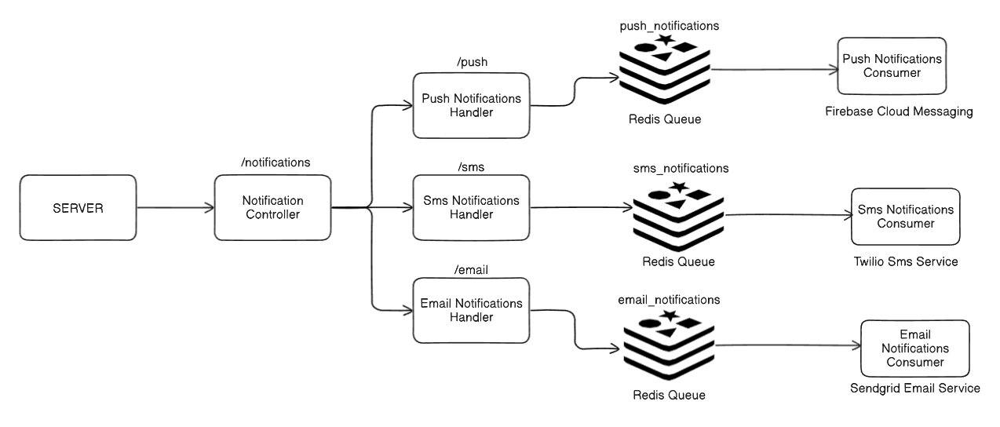

# Notification Service

The Notification Service is a Node.js application designed to handle the delivery of notifications through various channels such as push notifications, emails, and SMS. It provides a flexible and scalable solution for sending notifications to users across different platforms.

## High-Level Diagram




We can use kafka for persistance and scalability.
Rate limiter can be added as well based on the notification tag, like 1 per day for promotional mails etc.


### Components:

1. **Client Application**: The client application sends notification requests to the Notification Service via RESTful APIs.

2. **Notification Controller**: The Notification Controller receives incoming notification requests from the client application and dispatches them to the appropriate notification handler based on the specified channel (e.g., push, email, SMS).

3. **Notification Handler**: Each notification handler is responsible for processing notifications for a specific channel. Handlers enqueue notifications to the corresponding Redis queue for asynchronous processing.

4. **Redis**: Redis is used as a message broker to decouple the notification service from the notification delivery process. It provides reliable queuing and ensures that notifications are processed in a scalable and fault-tolerant manner.

5. **Notification Consumers**: Notification consumers listen to the Redis queues and process notifications asynchronously. Each consumer is responsible for delivering notifications via a specific channel.

## Setup Instructions

To set up and run the Notification Service locally, follow these steps:

1. Clone the repository to your local machine:

```bash
git clone https://github.com/your-username/notification-api.git
cd notification-api
npm i
```
2. Proivde environment keys as in `.env.development.local`
3. Provide `src/config/serviceAccountKey.json` of firebase for cloud messaging for push notifications.